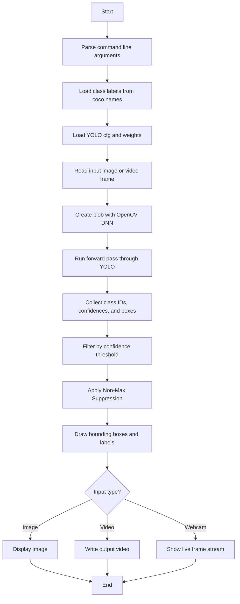

# YOLO Object Detection with OpenCV

This project shows how to detect objects in images, video files, and live webcam streams using:

- `YOLOv3` for object detection
- `OpenCV` for computer vision and DNN inference
- `Python` as the application language

The project was adapted from an existing reference repository and reorganized into a cleaner local setup. The concept, model files, and general approach were inspired by the original source, while this version is written as a personal working copy.

## Project Goal

The goal is to understand the full object-detection pipeline:

1. load a pre-trained YOLO model
2. read an input image, video, or webcam frame
3. run inference through OpenCV’s DNN module
4. collect predictions and confidences
5. apply non-max suppression
6. draw bounding boxes and labels on the output

## Tech Stack

### Core Technologies

- `Python 3`
- `OpenCV` for reading media and running deep-learning inference
- `YOLOv3` as the object detection model
- `COCO dataset` labels for the detected classes

### Python Packages

- `numpy` for array math and bounding-box handling
- `opencv-python` for `cv2`
- `imutils` for webcam/video helpers in the real-time demo

### Model Assets

The `yolo-coco` folder is expected to contain:

- `yolov3.cfg` - YOLO network configuration
- `yolov3.weights` - trained model weights
- `coco.names` - class labels used by the detector

## What YOLO Is Doing

YOLO stands for **You Only Look Once**. It predicts objects in a single forward pass instead of scanning an image in many steps.

In this project, YOLO detects objects such as:

- people
- bicycles
- cars
- dogs
- chairs
- bottles
- bags

The model is trained on the COCO dataset, which contains 80 common object categories.

## How The Code Works

Each script follows the same general pipeline:

1. Parse command-line arguments
2. Load the class names from `coco.names`
3. Generate a color for each class
4. Load the YOLO config and weights
5. Read the input image, video, or webcam frame
6. Build a blob from the image/frame
7. Run a forward pass through the network
8. Extract detections with class IDs and confidence scores
9. Filter weak predictions using a confidence threshold
10. Apply non-max suppression to remove overlapping boxes
11. Draw labels and bounding boxes
12. Display or save the final result

## Flowchart



## Repository Structure

- `Object dection using image/` - image detection demo
- `Object detection using video/` - video detection demo
- `real-time-object-detection/` - webcam-based real-time demo
- `yolo-coco/` - model files and class names

## Key Parameters

### Image and Video Demos

The main scripts use these common parameters:

- `--confidence` or `-c`
  - minimum confidence required to keep a detection
  - default: `0.5`
- `--threshold` or `-t`
  - non-max suppression threshold
  - default: `0.3`

### Image Script Parameters

`yolo.py`:

- `--image` or `-i`
  - path to the input image

### Video Script Parameters

`yolo_video.py`:

- `--input` or `-i`
  - path to the input video
- `--output` or `-o`
  - path where the output video is written
- `--yolo` or `-y`
  - base folder containing YOLO model files

### Real-Time Script

`real_time_object_detection.py`:

- uses webcam source `0`
- uses `MobileNetSSD_deploy.prototxt.txt`
- uses `MobileNetSSD_deploy.caffemodel`
- uses a fixed confidence threshold inside the script

## Installation

Install the required packages:

```bash
pip install numpy opencv-python imutils
```

If you want a safer setup, you can also create and activate a virtual environment first.

## How To Run

Make sure you are inside the repository folder:

```bash
cd "C:\Users\M S I\Desktop\VSCode\Object detection_YOLO\YOLO-object-detection-with-OpenCV"
```

### 1. Run Image Detection

```bash
python "Object dection using image/yolo.py" --image "Object dection using image/images/baggage_claim.jpg"
```

### 2. Run Video Detection

```bash
python "Object detection using video/yolo_video.py" --input "Object detection using video/videos/airport.mp4" --output "Object detection using video/output/airport_output.avi" --yolo yolo-coco
```

### 3. Run Real-Time Webcam Detection

```bash
python "real-time-object-detection/real_time_object_detection.py"
```

## Expected Output

- Image demo opens a window with boxes and labels drawn on the image
- Video demo saves an output `.avi` file and may also process multiple frames
- Webcam demo opens a live camera window and draws detections in real time

## Important Notes

- The YOLO model files must be real files, not Git LFS pointer stubs.
- If `yolov3.cfg` or `yolov3.weights` are tiny text files, the detector will not run.
- The folder name `Object dection using image` is kept as it appears in the original project.
- The scripts use Windows-style backslashes in a few string paths, which can produce `SyntaxWarning` messages in newer Python versions.
- If OpenCV compatibility issues appear, use a stable `opencv-python 4.x` build.

## Troubleshooting

### `ReadDarknetFromCfgStream` Error

This usually means one of the YOLO model files is not the actual model file. Check:

```bash
Get-Item "yolo-coco\yolov3.cfg","yolo-coco\yolov3.weights" | Select-Object Name,Length
```

If the files are only a few bytes long, they are probably Git LFS pointers instead of the real model assets.

### Webcam Does Not Open

- Make sure your camera is not being used by another app
- Check Windows camera permissions
- Try another camera index if needed

### Import Errors

- Confirm `numpy`, `opencv-python`, and `imutils` are installed in the same Python environment you are using to run the script

## Attribution

Original reference repository:

https://github.com/yash42828/YOLO-object-detection-with-OpenCV

This workspace version keeps the project idea and core workflow inspired by that source, while presenting it as a cleaner personal project write-up.


## Screenshots


Notice how our deep learning object detector can detect not only a person, but also the sofa and the chair next to person — all in real-time!

Just follow☝️ me and Star⭐ my repository
